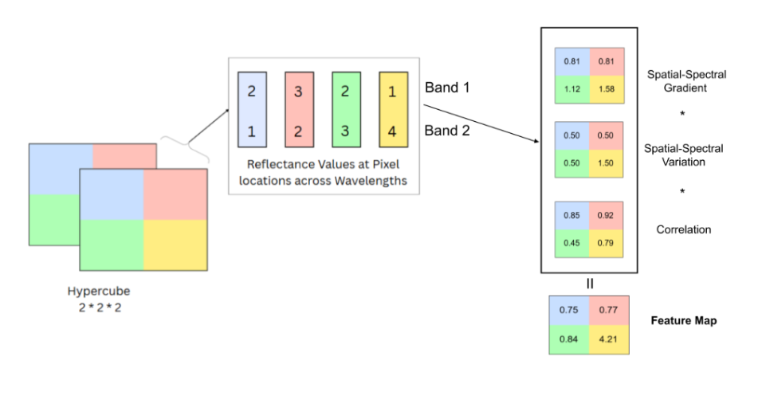
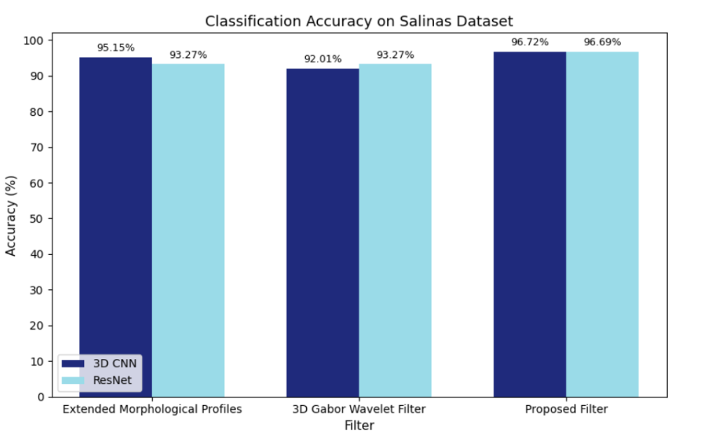

# SS-GVC: Spatial–Spectral Gradient Variation Correlation Filter

## Overview

SS-GVC (Spatial–Spectral Gradient Variation Correlation) is a novel spatial–spectral filtering framework developed to enhance feature extraction for hyperspectral image (HSI) classification. Hyperspectral images capture hundreds of spectral bands per pixel, providing detailed material information but also introducing high dimensionality, redundancy, and noise.

Conventional filtering approaches such as 3D Gabor filters and Extended Morphological Profiles (EMP) often process spatial and spectral information independently or combine them using heuristic strategies, which limits their ability to model complex spatial–spectral dependencies. SS-GVC addresses this challenge by simultaneously fusing spatial gradients, spectral variation, and local spatial–spectral correlation through a mathematically grounded multiplicative formulation.

---

## Workflow

The overall processing pipeline illustrating SS-GVC integration within a hyperspectral classification framework is shown below.

---

## Key Contributions

- Unified spatial–spectral feature extraction framework  
- Simultaneous computation of gradient, variation, and correlation descriptors  
- Novel multiplicative fusion strategy for enhanced discriminative representation  
- Improved edge preservation and spectral continuity  
- Computationally efficient design suitable for large hyperspectral scenes  
- Robust performance across multiple benchmark datasets  

---

## Methodology

At each pixel location \((i, j)\), the SS-GVC filter computes three complementary descriptors:

### Spatial–Spectral Gradient Magnitude (G)

Captures local edge strength and spatial structure across spectral bands. Gradient magnitudes are computed for each band using horizontal and vertical differences and aggregated across the spectral dimension to emphasize spatial transitions and object boundaries.

### Spectral Variation (V)

Represents the standard deviation of reflectance values across all spectral bands at a given pixel. This component quantifies spectral heterogeneity and enhances discrimination between materials with subtle spectral differences.

### Spatial–Spectral Correlation (C)

Measures the similarity between the spectral signature of a pixel and its neighboring pixels using cosine similarity within an 8-connected neighborhood. This component preserves local spatial–spectral consistency and contextual information.

---

## Experimental Results

The SS-GVC filter has been evaluated on standard hyperspectral benchmark datasets and compared with traditional filtering techniques such as 3D Gabor and 3D Extended Morphological Profiles (EMP).

### Datasets

- Indian Pines  
- Salinas  
- Pavia University  

---

## Classification Results

### Indian Pines Dataset

- Achieves up to **99.93% overall accuracy**, outperforming all baseline filters and classifiers.

---

### Pavia University Dataset

- Achieves up to **99.65% accuracy** with 3D-CNN  
- Achieves **92.86% accuracy** with ResNet-based architectures

---

### Salinas Dataset

- Achieves up to **96.72% accuracy** with 3D-CNN  
- Achieves **96.69% accuracy** with ResNet

---

## Computational Performance

The execution time comparison across datasets demonstrates the computational efficiency of the SS-GVC filter.

Across multiple runs, SS-GVC consistently requires lower average processing time than baseline filters while maintaining superior classification accuracy, making it suitable for large-scale and near real-time hyperspectral analysis.

---

## Qualitative Results

Classification maps generated using SS-GVC-enhanced features exhibit improved spatial coherence, sharper class boundaries, and significantly reduced salt-and-pepper noise compared to results obtained using conventional filtering techniques.

---

## Applications

SS-GVC is applicable to a wide range of hyperspectral imaging tasks, including:

- Precision agriculture and crop monitoring  
- Environmental monitoring and land-use mapping  
- Disaster response and damage assessment  
- Urban planning and smart city analysis  
- Mineral and geological exploration  
- Defense and surveillance  
- Medical and industrial hyperspectral imaging  

---

## Integration

The SS-GVC filter is designed to integrate seamlessly with existing hyperspectral processing pipelines and can be used as a preprocessing or feature enhancement module prior to classification using deep learning or traditional machine learning models.
